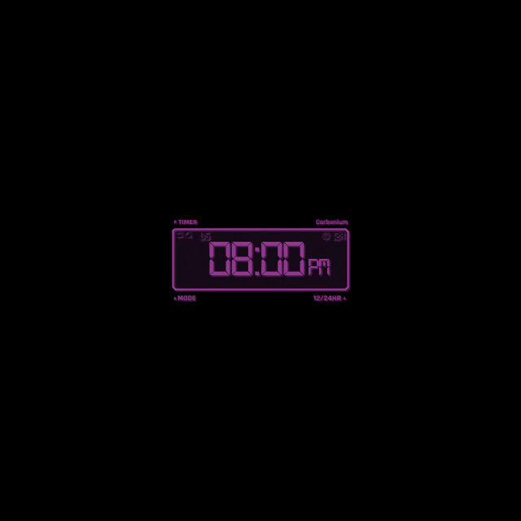

# Cyberpunk 2077 Inspired Clock

 <!-- Add path to your preview image -->

SensorPanelCyberpunk This Rainmeter skin displays a 12-hour digital clock with a retro, digital-display aesthetic inspired by old-school clocks. The clock shows the current time in hours and minutes, along with an AM/PM indicator, all in a vibrant purple color scheme.


Features

## Features

- 12-hour format with AM/PM indicator. Can be switched to 24-hr format.
- Minimalistic digital display design.
- Cyberpunk-inspired design with a clean, modern interface.
- Easy-to-use configuration and customization options.
- Interactive clock: click on the time to open the system time settings.
- Uses fonts that complement the cyberpunk style.

## Requirements

1. **Rainmeter** - [Download Rainmeter](https://www.rainmeter.net/)
3. **Fonts**:
   - [DS-Digital Font](https://www.dafont.com/ds-digital.font) - Used for the digital clock and numeric displays.
   - [Rajdhani Font](https://github.com/itfoundry/rajdhani) - Used for text elements in the background.
  
Make sure to install these fonts to get the intended visual style!

## Installation

1. **Install Rainmeter**:
   - Download and install Rainmeter from the [official website](https://www.rainmeter.net/).

2. **Clone or Download the Project**:
   - Clone the repository:  
     ```bash
     git clone https://github.com/DevChrisL/CyberpunkClock.git
     ```
   - Or download the latest release from the [releases page](https://github.com/DevChrisL/CyberpunkClock/releases).

4. **Install Fonts**:
   - Download and install the [DS-Digital Font](https://www.dafont.com/ds-digital.font).
   - Download and install the [Rajdhani Font](https://github.com/itfoundry/rajdhani).

5. **Apply the Skin**:
   - Open Rainmeter, click the Rainmeter icon in the system tray.
   - Select "Manage" and navigate to the folder where you downloaded the skin.
   - Load the skin, and customize it based on your preferences using the Rainmeter settings.

## License

This project is licensed under the [Creative Commons BY-ND 4.0](https://creativecommons.org/licenses/by-nd/4.0/).

## Acknowledgments

* [Rainmeter documentation for measures, meters and more](https://docs.rainmeter.net/manual/)
* [DS-Digital font designed by Dusit Supasawat](https://www.dafont.com/font-comment.php?file=ds_digital)
* [Rajdhani font designed by itfoundry](https://github.com/itfoundry/rajdhani?tab=readme-ov-file)
